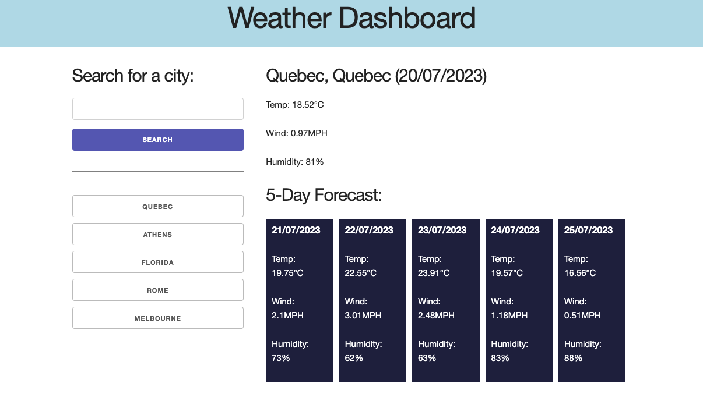

# Weather Dashboard

## Table of Contents

1. [Description](#description)
2. [Deployed Application](#deployed-application)
3. [API](#api)
4. [Creator](#creator)
5. [License](#license)

## Description

A weather app to get the current weather and a five-day forecast for your city. Data includes temperature, wind speed and humidity. Previous searches are saved to your local storage as you go.

## Deployed Application

<https://katyjmt.github.io/do-i-need-a-jacket/>

## API

OpenWeatherMap (<https://openweathermap.org/api/>) 
jQuery (<https://api.jquery.com/>) 
dayjs (<https://day.js.org/>)

## Creator

**katyjmt** : <https://github.com/katyjmt> 

## License

Code released under the MIT License.